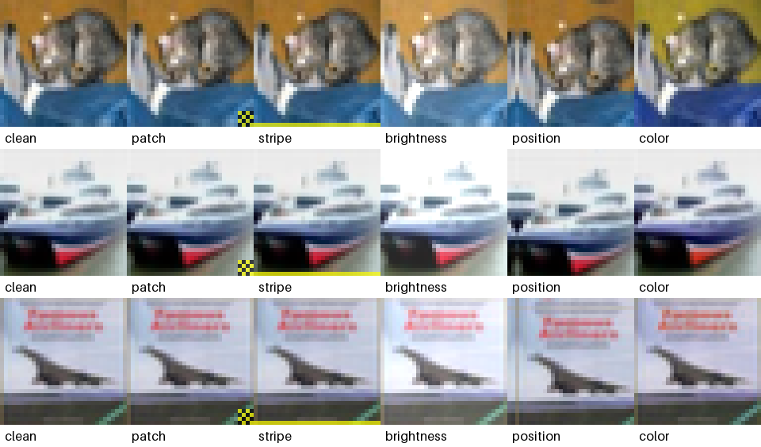

# P16: сравнение форм триггера

Учебный проект сравнивает пять backdoor-триггеров на CIFAR-10:

- локальный шахматный патч 4x4;
- горизонтальная полоса шириной 1 пиксель;
- увеличение яркости на 15% полного пиксельного диапазона;
- сдвиг изображения на 2 пикселя вправо и вниз;
- поворот оттенка на 16 градусов.



Численный предварительный аудит заметности: [docs/visibility-audit.md](docs/visibility-audit.md).

Главный вопрос: какой триггер модель легче выучивает при одинаковой доле отравления и сопоставимой заметности для человека?

## Текущий статус

Проект подготовлен до границы длительного обучения:

- все пять триггеров реализованы через единый интерфейс;
- poisoning выбирает только изображения нецелевых классов и может сохранять распределение классов;
- CIFAR-10 делится на train/validation детерминированно;
- реализована компактная CNN;
- готовы чистая и triggered тестовые выборки с одинаковым порядком объектов;
- реализованы clean accuracy, ASR, conditional ASR, ASR по исходным классам и запас целевого логита;
- готов CLI для clean/poisoned обучения и полного набора экспериментов;
- smoke-режим проверяет весь конвейер без обновления весов;
- основной notebook подготовлен, а команды обучения оставлены неисполненными.

## Логика ASR

Целевой класс по умолчанию - класс `0` (`airplane`). Для ASR берутся изображения остальных классов:

1. модель получает чистое изображение;
2. к той же картинке добавляется выбранный триггер;
3. проверяется, стал ли ответ равен целевому классу.

Обычный ASR исключает настоящие самолеты. Conditional ASR дополнительно исключает изображения, которые модель распознала неправильно еще до триггера.

## Структура

```text
configs/                  параметры данных, CNN, обучения и триггеров
docs/                     экспериментальный протокол
notebooks/                основной исследовательский notebook
scripts/prepare_data.py   загрузка CIFAR-10 без обучения
scripts/audit_triggers.py визуальная проверка триггеров на CIFAR-10
scripts/train.py          smoke test или один запуск обучения
scripts/run_matrix.py     список или запуск полной матрицы
src/p16_triggers/         данные, модель, обучение, триггеры и метрики
tests/                    unit и pipeline tests
artifacts/                генерируемые изображения
checkpoints/              веса обученных моделей
results/runs/             JSON каждого запуска
```

## Установка

Рекомендуется Python 3.12:

```powershell
python -m venv .venv
.venv\Scripts\Activate.ps1
python -m pip install --upgrade pip
python -m pip install -e ".[train,dev]"
```

Для запуска notebook дополнительно:

```powershell
python -m pip install -e ".[notebook]"
```

## Подготовка до обучения

Загрузить CIFAR-10:

```powershell
python scripts/prepare_data.py
```

Проверить код:

```powershell
python -m unittest discover -s tests -v
```

Сделать сетку триггеров на реальных изображениях CIFAR-10:

```powershell
python scripts/audit_triggers.py
```

Проверить чистый pipeline одним прямым проходом без обучения:

```powershell
python scripts/train.py --mode clean --trigger patch --seed 17 --smoke-test --max-train-samples 512 --max-eval-samples 256
```

Проверить poisoned pipeline без обучения:

```powershell
python scripts/train.py --mode poisoned --trigger patch --poison-fraction 0.03 --seed 17 --smoke-test --max-train-samples 512 --max-eval-samples 256
```

Ожидаемый smoke-статус: `ready_for_training`, вход `(batch, 3, 32, 32)`, выход `(batch, 10)` и ненулевое число отравленных объектов в poisoned-режиме.

## Следующий шаг: обучение

Эти команды уже обновляют веса модели и поэтому являются границей завершенной подготовки.

Чистая модель:

```powershell
python scripts/train.py --mode clean --trigger patch --seed 17
```

Модель с патчем и долей отравления 3%:

```powershell
python scripts/train.py --mode poisoned --trigger patch --poison-fraction 0.03 --seed 17
```

Посмотреть все 48 запланированных запусков без выполнения:

```powershell
python scripts/run_matrix.py
```

Начать полную матрицу можно только явным флагом:

```powershell
python scripts/run_matrix.py --execute
```

Основной notebook: [notebooks/01_trigger_comparison.ipynb](notebooks/01_trigger_comparison.ipynb). Подробный протокол: [docs/experiment-plan.md](docs/experiment-plan.md).
Проверенные версии локального окружения: [docs/tested-environment.md](docs/tested-environment.md).

## Фиксированность фигурных триггеров

Основной эксперимент использует фиксированные положение и ориентацию, чтобы сравнивать именно форму триггера. Рандомизация положения и поворота остается отдельным экспериментом на переносимость и не смешивается с основной таблицей.
