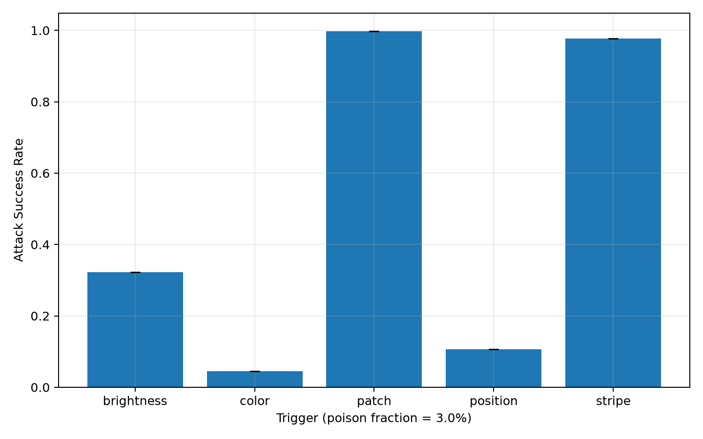
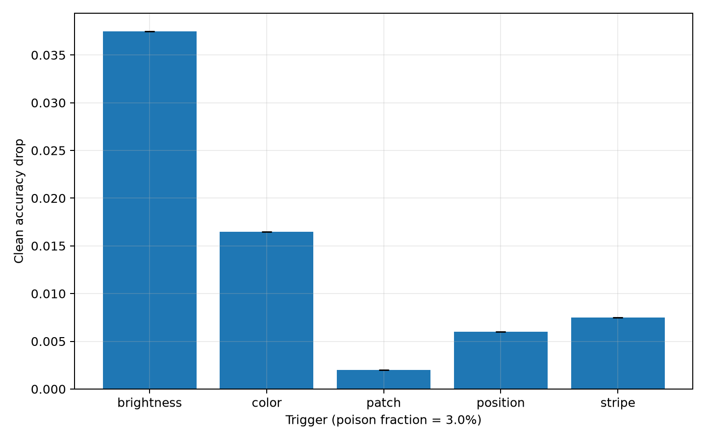

# CPU-пилот: 10k, seed 17, poisoning 3%

Первый сопоставимый эксперимент с реальным обучением завершён на машине без
GPU. Он предназначен для проверки гипотезы и работоспособности протокола, а не
заменяет полную матрицу из трёх seeds и трёх долей poisoning.

## Протокол

- CIFAR-10: 10 000 train, 2 000 validation и 2 000 test, стратифицированно;
- целевой класс: `0` (`airplane`);
- 300 poisoned train-примеров в каждой атакованной модели (`rho = 3%`);
- одна clean baseline и пять poisoned-моделей, `seed = 17`;
- CompactCNN, 12 эпох, batch 128, AdamW, `lr = 0.001`;
- для оценки загружен checkpoint с лучшей validation accuracy;
- положение и ориентация триггеров фиксированы;
- данные без аугментаций, PyTorch 2.13.0 CPU, 8 потоков.

Пример воспроизводимой команды после обычной загрузки CIFAR-10:

```powershell
python scripts/train.py --mode poisoned --trigger patch --poison-fraction 0.03 --seed 17 --epochs 12 --max-train-samples 10000 --max-eval-samples 2000 --device cpu --batch-size 128 --eval-batch-size 256 --torch-threads 8
```

## Результаты

Clean baseline accuracy: **71.20%**. Её ASR для patch без poisoning равен
3.94%, а conditional ASR — 0%, то есть исходная модель не реагирует на patch как
на настоящий backdoor.

| Триггер | Clean accuracy | Падение к baseline | ASR | Conditional ASR | Target margin |
| --- | ---: | ---: | ---: | ---: | ---: |
| patch | 71.00% | 0.20 п.п. | **99.83%** | **99.76%** | **+16.87** |
| stripe | 70.45% | 0.75 п.п. | **97.67%** | **97.06%** | **+11.81** |
| brightness (+15%) | 67.45% | 3.75 п.п. | 32.22% | 23.45% | -1.14 |
| position (+2/+2 px) | 70.60% | 0.60 п.п. | 10.61% | 7.02% | -2.74 |
| color (+16 degrees hue) | 69.55% | 1.65 п.п. | 4.50% | 0.71% | -3.90 |





Полные числа находятся в [summary.csv](summary.csv), а история каждой эпохи и
ASR по исходным классам — в шести JSON-файлах рядом с этим отчётом.

## Предварительный вывод

В этом пилоте маленькие локальные и неизменные формы выучились намного легче
глобальных преобразований. Patch оказался лучшим: почти 100% ASR при падении
обычной точности всего на 0.20 процентного пункта. Stripe очень близок к нему.

Brightness заметен человеку сильнее, но модель выучила его только частично и
потеряла больше обычной точности. Position и color почти не сформировали
backdoor. Поэтому визуальная заметность и обучаемость триггера — разные свойства.

Ограничение: один seed и одна доля poisoning не позволяют оценить дисперсию.
Следующий научно корректный шаг — повторить этот срез для seeds 29 и 43, затем
проверить доли 1% и 5%.
